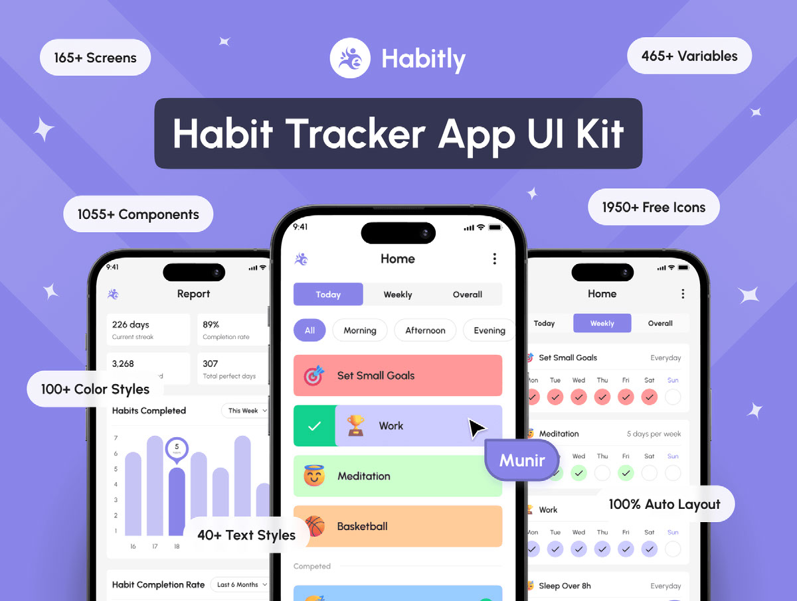

<div align="center">
  
  <br>
</div>

<p align="center">
  <a href="https://github.com/DIMFLIX/github-widgetbox">
    
  </a>
</p>

# Hey, I'm zaki 👋

I'm an app dev and js lover.<br>
🚀 I love using React Native because it's crossPlatform framework and based on js.<br>
⚡ enjoy contributing to open source projects<br>
📚 I'm expanding my knowledge to the backend side of app developement<br>

# 📊 **this week i spent my time on:**
<!--START_SECTION:waka-->

```txt
Total Time: 1 hr 16 mins

TypeScript   45 mins               ██████████████▓░░░░░░░░░░   59.32 %
JavaScript   30 mins               ██████████░░░░░░░░░░░░░░░   39.56 %
CSS          0 secs                ░░░░░░░░░░░░░░░░░░░░░░░░░   00.63 %
Git Config   0 secs                ░░░░░░░░░░░░░░░░░░░░░░░░░   00.50 %
```

<!--END_SECTION:waka-->

## 🐍 Contribution Snake

<p align="center">
  
</p>

# 🚀 Featured Projects
<!--
from here
-->
## 📱 Habit Tracker

<p align="center">
  
</p>

Habit tracking app in react native

🔹 Create and edit unlimited habits<br>
🔹 Help you track you're daily progress<br>
🔹 it's Gamified with level up system and streaks<br>

🛠️ **Tech stack:** React Native • Expo • cleark

🔗 **Links:** [📂 Source Code](https://github.com/zakilisee/) • [🚀 Live Demo](https://github.com/zakilisee/)

---

<!--to here-->

# 🌐 Socials:

[](https://linkedin.com/in/zakilisee)
[](https://x.com/zakilisee)
[](https://instagram.com/zakilisee)
[](https://youtube.com/@zakilisee)
[](https://discord.gg/gE2TVbjcyj)

# 💻 Tech Stack:


# 📊 GitHub Stats:


## 🏆 GitHub Trophies


## 💰 if you like what i do, maybe consider buying me a coffee/tea 🥺👉👈
  [](https://buymeacoffee.com/https://buymeacoffee.com/onlyzaki) 
  
for freelance work? do reach, [email]() :)

